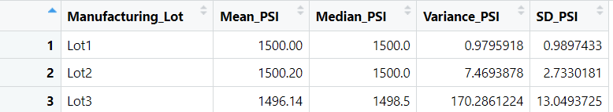
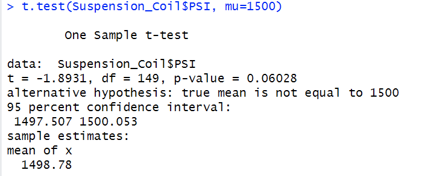
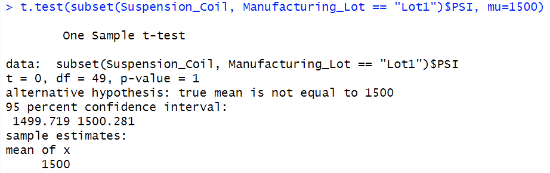
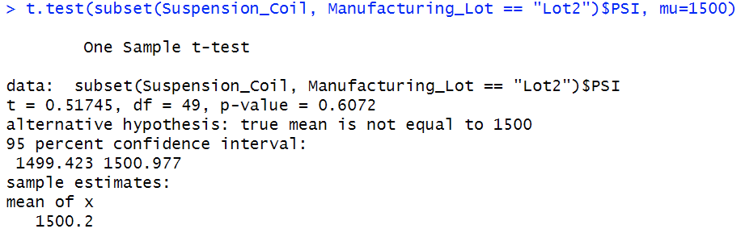
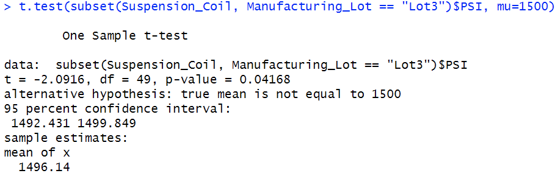

# MechaCar_Statistical_Analysis
## Overview of Project
A few weeks after starting his new role, Jeremy is approached by upper management about a special project. AutosRUs’ newest prototype, the MechaCar, is suffering from production troubles that are blocking the manufacturing team’s progress. AutosRUs’ upper management has called on Jeremy and the data analytics team to review the production data for insights that may help the manufacturing team.

## Linear Regression to Predict MPG

See the linear regression results above. 

Questions: 
* Which variables/coefficients provided a non-random amount of variance to the mpg values in the dataset?

    Vehicle_length and ground_clearance variables provided a non-random amount of variance to the mpg. These two have a significant impact on mpg on the MechaCar prototype. 

* Is the slope of the linear model considered to be zero? Why or why not?

    The p-value of 5.35e-11 is much smaller than 0.05%, indicating that there is sufficient evidence to reject the null hypothesis. Therefore, the slope of the linear model is not zero. 

* Does this linear model predict mpg of MechaCar prototypes effectively? Why or why not?

    Yes, this linear model predicts mpg of MechaCar prototypes effectively because this linear model has an R-squared value of 0.7149, which shows a high level of correlation and indicates that approximately 71% of mpg predictions will be explained by this model. 

## Summary Statistics on Suspension Coils
The MechaCar Suspension_Coil.csv dataset contains the results from multiple production lots. In this dataset, the weight capacities of multiple suspension coils were tested to determine if the manufacturing process is consistent across production lots.
We created a summary statistics table to show:
1. The suspension coil’s PSI continuous variable across all manufacturing lots.

2. The following PSI metrics for each lot: mean, median, variance, and standard deviation.

Question: 

* The design specifications for the MechaCar suspension coils dictate that the variance of the suspension coils must not exceed 100 pounds per square inch. Does the current manufacturing data meet this design specification for all manufacturing lots in total and each lot individually? Why or why not? 

See total summary table results: 

See lot summary table results: 

We look at the all manufacturing lots, noting that the variance of the suspension coils is 62.29 PSI, which does not exceed the 100 PSI requirement. Then we further look at the individual lot, noting that Lot 1 and Lot 2 are within the 100 PSI requirement with variances of 0.98 and 7.47 respectively, while Lot 3 is way higher than the 100 PSI requirement wiht a variance of 170.29. 

## T-Tests on Suspension Coils
In this deliverable, we performed t-tests to determine if all manufacturing lots and each lot individually are statistically different from the population mean of 1,500 pounds per square inch.

See t-test for all lots: 

It shows that the mean of the sample for all lots is 1498.78, and the p-Value of 0.06, which is higher than 0.05. Therefore, it indicates that there is not sufficient evidence to reject the null hypothesis. Hence, the mean of all lots is statistically similar to the presumed population mean of 1500.

See t-test for lot 1:
 
 
 The mean of the sample for Lot 1 is 1500. The p-value of 1 is higher than 0.05. TTherefore, it indicates that there is not sufficient evidence to reject the null hypothesis. Hence, there is no statistical difference between sample mean and population mean. 
See t-test for lot 2:

The mean of the sample for Lot 2 is 1500.02. The p-value of 0.61 is higher than 0.05. Therefore, it indicates that there is not sufficient evidence to reject the null hypothesis. Hence, there is no statistical difference between sample mean and population mean.

See t-test for lot 3:  

The mean of the sample for Lot 3 is 1496.The p-value of 0.04 is lower than 0.05. There is sufficient evidence to reject the null hypothesis. Hence, there is statistical difference between sample mean and population mean. 

In summary, Lot 3 seems to cause several fails and the process needs to be inspected further. 

## Study Design: MechaCar vs Competition 
A statistical study to compare performance of the MechaCar vehicles against performance of vehicles from other manufacturers will include:

A metric to be tested is mentioned
* A null hypothesis or an alternative hypothesis is described
* A statistical test is described to test the hypothesis

1. What metric or metrics are you going to test?
We shall collect data for models that are comparable across all manufacturers for longer period (such as 3 years) to further evaluate the correlation level. 

2. What is the null hypothesis or alternative hypothesis?
Null hypothesis: MechaCar is competitive and comparable to models from all other manufacturers.
Alternative hypothesis: MechaCar is NOT competitive and comparable to models from all other manufacturers.

3. What statistical test would you use to test the hypothesis? And why?
Multiple linear regression would be used because higher correlation level and predictability is determined.

4. What data is needed to run the statistical test? 
Vehicle price, Vehicle Weight, Vehicle Engine Serial, Vehicle MPG, etc.
